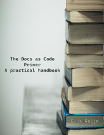
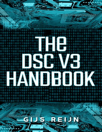
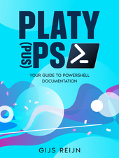
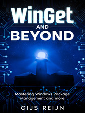

# Hi, I'm Gijs :wave:

I'm an IT professional who loves to make life easier by automation as much as possible. My passion has grown to share my learnings through blog posts or making contributions to open-source projects in various technologies. Some of the technologies I enjoy working the most with include PowerShell, Azure Bicep, Azure DevOps, WinGet, and Azure. Despite my drive for these technologies, I don't want to limit myself and am always open to learning more. In 2025, I have become a Microsoft MVP in the PowerShell and Windows category.

---

## My Social Connections and Content :star2:

- You can find my blog post on [Medium][00], [Rabo Tech Blog][01] or [I don't like AI][02]
- I regularly share updates on [LinkedIn][03], [X][04], or [Bluesky][21]
- Want to have a talk? Check me out on [Discord][05]

## Books :books:

| Title                         | Subtitle                                      | Description                                                                                                                                                                                                                                                           |                                                                  |
|-------------------------------|-----------------------------------------------|-----------------------------------------------------------------------------------------------------------------------------------------------------------------------------------------------------------------------------------------------------------------------|------------------------------------------------------------------|
| [The Docs as Code Primer][06] | A practical handbook                          | [_The Docs as Code Primer_][06] is an easy-to-use practical handbook to mastering the art of the Docs as Code philosophy. With tons of hands-on exercises, this book is perfectly suited for techies and technical writers alike.                                     |  |
| [The DSC V3 Handbook][07]     |                                               | Getting started with Desired State Configuration (DSC)? I wrote this [book][07] to teach the new version 3, which has become more cross-platform, allowing you to configure not only Windows machines, but also MacOS and Linux                                       |      |
| [Platy(pus)PS][08]            | Your guide to PowerShell documentation        | When you are looking how you can write PowerShell documentation the best way, the [Platy(pus)PS][08] is your go-to book. It has been written on the newly released `Microsoft.PowerShell.PlatyPS` module and covers a lot of fun exercises you can follow along with. |                     |
| [WinGet and Beyond][09]       | Mastering Windows Package Management and more | The WinGet and Beyond book is your go-to guide for mastering WinGet and exploring its integration with Microsoft tools like DSC and DevHome. Packed with code samples, labs, and tips, this book is perfect for IT pros and developers ready to level up their skills |      |

## Current projects and work :construction:

While my interests in the IT field are diverse, you'll likely spot certain patterns in the projects I work on. Below are some examples of my work, available on my GitHub.

| Name                                   | Repository               | Notes                                                                                                                      |
|----------------------------------------|--------------------------|----------------------------------------------------------------------------------------------------------------------------|
| PowerShell Desired State Configuration | [PSDSC][10]              | A PowerShell module containing commands that interact with `dsc.exe`. Don't confuse it with `PSDesiredStateConfiguration`. |
| DevOps Feeds                           | [DevOpsFeeds][11]        | A repository housing DevOps Feeds newsletters with MailChimp and Azure DevOps.                                             |
| My random tools                        | [random-tools-gijs][12]  | A repository storing my PowerShell scripting content and modules.                                                          |
| Bicep Local Deploy doc generator       | [bicep-local-docgen][22] | A repository containing a library, template, and CLI utility for Bicep Local Deploy models                                 |

In addition to my GitHub contributions, I also share my insights and experiences on different blogging sites.

- [A first look at Desired State Configuration v3][13]
- [My Methods To Use PowerShell In Azure DevOps][14]
- [Azure Update Manager series][15]
- [The many ways to connect Azure Artifacts for PowerShell modules][16]
- [How to Manage your Software Solution with One Tool][17]
- [How to deploy Azure policy: The DevOps way][18]

## GitHub Stats 🐙

[![My GitHub stats][19]][20]

<!-- Link reference definitions -->
[00]: https://medium.com/@gijsreijn
[01]: https://rabobank.jobs/en/techblog/coding-architecture/
[02]: https://idontlikeai.dev
[03]: https://linkedin.com/in/gijs-reijn-582b81198/
[04]: https://x.com/GijsReijn
[05]: https://discordapp.com/users/409441414292701214
[06]: https://leanpub.com/thedocsascodeprimer
[07]: https://leanpub.com/thedscv3handbook
[08]: https://leanpub.com/platyps
[09]: https://leanpub.com/wingetandbeyond
[10]: https://github.com/Gijsreyn/PSDSC
[11]: https://github.com/Gijsreyn/DevOpsFeeds
[12]: https://github.com/Gijsreyn/random-tools-gijs
[13]: https://medium.com/p/379ee8181d6a
[14]: https://medium.com/p/c082c90f1c6f
[15]: https://medium.com/p/437f02929c84
[16]: https://medium.com/p/a150df369a21
[17]: https://rabobank.jobs/en/techblog/boost-productivity-how-to-manage-your-software-solution-with-one-tool/
[18]: https://rabobank.jobs/en/techblog/gijs-reijn-how-to-deploy-azure-policy-the-devops-way/
[19]: https://github-readme-stats.vercel.app/api?username=gijsreyn&show_icons=true&theme=dark
[20]: https://github.com/gijsreyn/github-readme-stats
[21]: https://bsky.app/profile/gijsreijn.bsky.social
[22]: https://github.com/Gijsreyn/bicep-local-docgen
